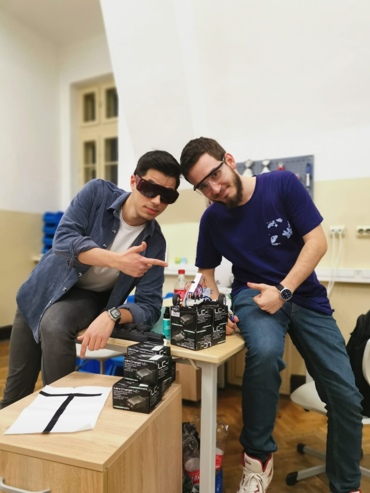

# Line Follower
This is the final project for the Introduction to Robotics course taken in the 3rd year at the Faculty of Mathematics and Computer Science, University of Bucharest.

This was a project that has been done in the span of a day during a mini hackathon. The project was carried out together with my teammate Stefan (_StefanBoboc_ on Github). 

---

## **Contents**  <a id="0"></a>
- [Technical Task.](#technical_task) 
- [Components.](#components)  
- [Pictures of the setup.](#setup_pics)
- [Project challenges.](#project_challenges)
- [Final Course.](#final_course)
- [Necessary Assignment Info.](#assignment_info)

---

### Technical Tasks <a id="technical_task"></a>
The main objectives of this project were the following:
* assembly of the line follower in one of the course's labs;
* implementing basic algorithms to test the functionality of the components(DC motors running smoothly, the QTR-8A sensor giving proper feedback, etc.)
* to program a line follower with auto calibration for the sensors upon boot up;
* to implement and fine tune a PID controller which would enable the line follower to complete a test course as fast as possible (desired target was ~20 seconds).

---

### Components <a id="components"></a>
* 1 Arduino Uno;
* 1 car chassis; 
* 1 ball caster; 
* 2 DC motors; 
* L293D motor driver;
* 2 wheels; 
* 1 QTR-8A reflectance sensor array; 
* wires (per logic);
* zip ties (per logic).

---

## **Pictures of the setup.** <a id="setup_pics"></a>

|  |  | 
|:-------------:|:-------------:|
|  |  |

---

## **Picture of the team. (#Liniutzarii)**


---

## **Project challenges** <a id="project_challenges"></a>

### Auto Calibration
In order to receive a higher score on our line follower, one of the main tasks was making it automatically calibrate the QTR-8A sensor. This was something much easier said than done, as the initial idea of giving the wheel motors timed intervals in which they would change direction proved to be ineffective. Due to hardware factors(one DC motor outputing more power than the other), the line follower couldn't remain centered on the black line, making a little pirouette during the automatic calibration.  


After receiving tips and tricks from the course and lab teachers, we decided to opt for using the sensors as they were being calibrated. Starting from a centered position on the black line, the follower would turn left and once the rightmost sensor would be dead on the black line, the DC motors changed their direction of rotation. Then, once the leftmost sensor would be centered on the black line, the direction of rotation would be changed again, rinse and repeat.

---

### PID Controller
The PID calibrations were made after repeated testing on the test circuits, and the machine wheels speed is adapted accordingly

Video showing our line follower on a test circuit [here](https://youtu.be/AiGLdtWanJ4).

As you can see in the video, our tracker did very well on the winding part of the trail. But, on the straight line section, the higher the speed, the harder it was for the car to corner at the end of the straight. For this we added the following code which causes the car "to brake". 

```
if (error <= -warnningSpotSensorValue) {
    m2Speed -= reduceMotorSpeed;
  } 
  else if (error >= warnningSpotSensorValue) {
    m1Speed -= reduceMotorSpeed;
  }
```

When the sensors in the extremities were registering high error values (i.e. after the straight section there is a tight curve), the car was reducing it's speed considerably.

---

### Final course <a id="final_course"></a>
At the presentation of the project, our line follower, out of the three attempts, took the **best time of 21.761 seconds**.

Live course trial [here](https://youtu.be/STF4KL0HLZI).

---

### Necessary Assignment Info <a id="assignment_info"></a>
Teammate's repository [link](https://github.com/StefanBoboc/Line_Follower).

Team name: Liniutzarii :sunglasses:

